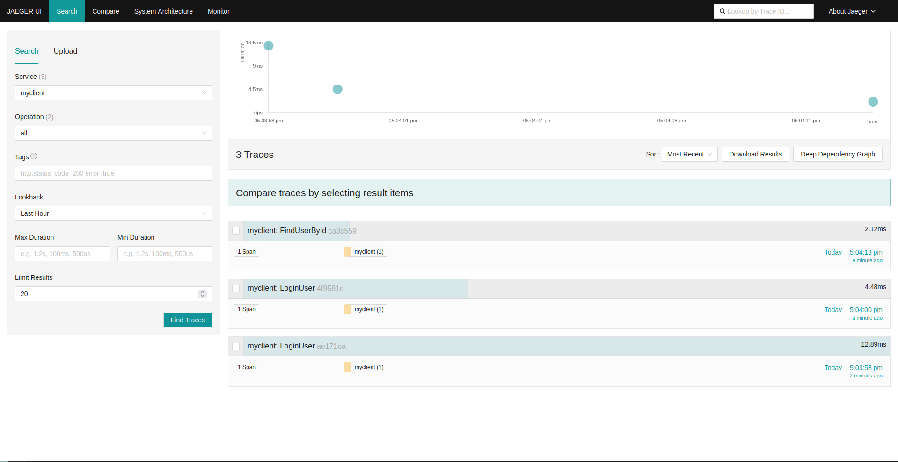
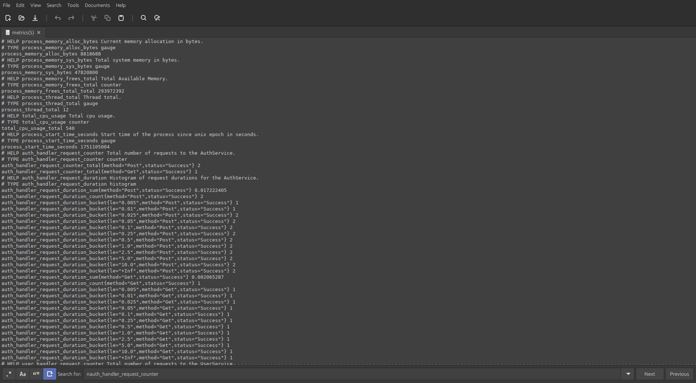
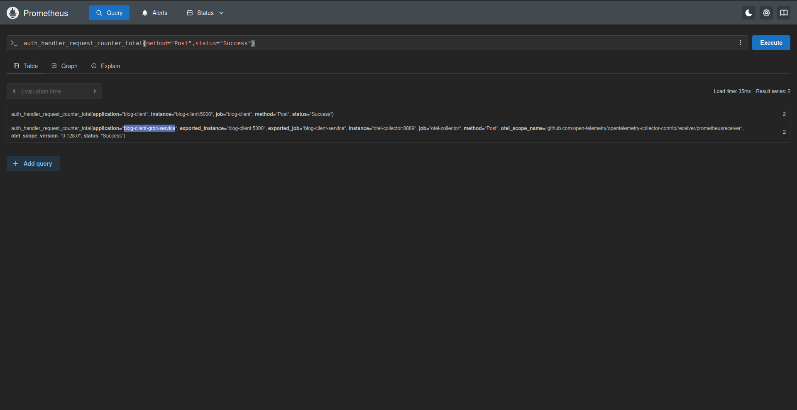

# 🚀 Example SeaQuery Tonic gRPC

Monorepo Rust project yang mengimplementasikan **REST API (Axum)** dan **gRPC (Tonic)** dengan arsitektur modular berbasis Cargo workspace. Dirancang untuk scalability, observability, dan kemudahan integrasi antar service.

---

## 🧱 Struktur Proyek

```txt
crates/
├── client        # REST API menggunakan Axum
├── server        # gRPC service menggunakan Tonic
├── shared        # Logic reusable: model, trait, service, utils
└── genproto      # Generated code dari file .proto
```

## 🦀 Teknologi Digunakan 

| Layer         | Teknologi                                                                                    |
| ------------- | -------------------------------------------------------------------------------------------- |
| REST API      | [Axum](https://github.com/tokio-rs/axum)                                                     |
| gRPC Server   | [Tonic](https://github.com/hyperium/tonic)                                                   |
| ORM/Query     | [SQLx](https://github.com/launchbadge/sqlx) + [SeaQuery](https://github.com/SeaQL/sea-query) |
| Observability | OpenTelemetry, Prometheus, Tracing                                                           |
| Auth          | JWT-based authentication & role guard                                                        |
| Config        | dotenv + modular config loader                                                               |


## Preview Screenshoot

### Jaeger



### Metrics




### Prometheus


---

## 🔍 Kesimpulan

Jika jaringan lemot mending github action yang jalanin compile docker nya dan jika jaringan kenceng build di local aja


## Hasil Build image dari github action

```txt
docker exec blog-client stat /app/client

  File: /app/client
  Size: 20130344  	Blocks: 39320      IO Block: 4096   regular file
Device: 59h/89d	Inode: 15731723    Links: 1
Access: (0755/-rwxr-xr-x)  Uid: ( 1000/ appuser)   Gid: ( 1000/ appuser)
Access: 2025-06-28 10:01:00.000000000 +0000
Modify: 2025-06-28 10:01:00.000000000 +0000
Change: 2025-06-28 10:02:33.912227904 +0000

20.1 mb client


docker exec blog-server stat /app/server
  File: /app/server
  Size: 15410856  	Blocks: 30104      IO Block: 4096   regular file
Device: 57h/87d	Inode: 15732274    Links: 1
Access: (0755/-rwxr-xr-x)  Uid: ( 1000/ appuser)   Gid: ( 1000/ appuser)
Access: 2025-06-28 10:00:52.000000000 +0000
Modify: 2025-06-28 10:00:52.000000000 +0000
Change: 2025-06-28 10:03:07.317740591 +0000

15.4 mb server
```